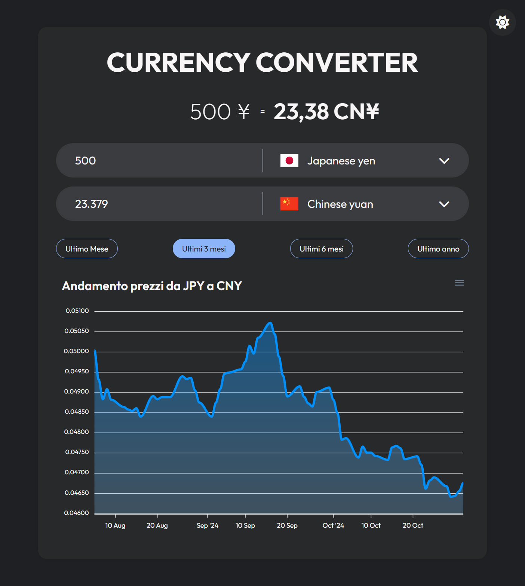
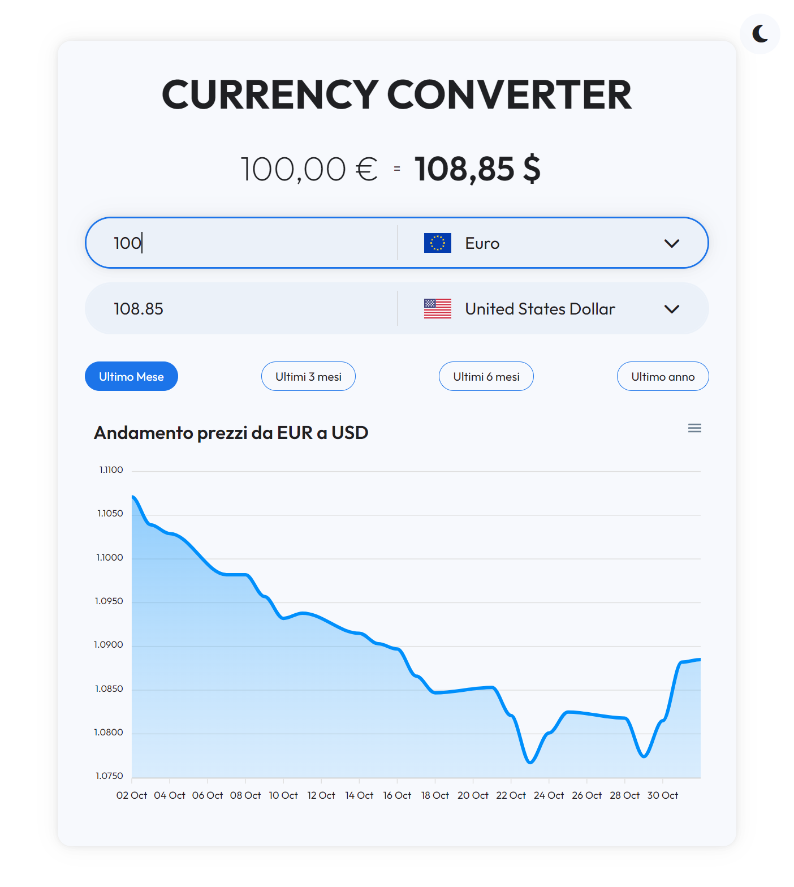

# Currency Converter

Currency Converter è un'applicazione sviluppata in React con Vite, progettata per aiutarti a convertire valute in modo semplice e veloce, oltre a visualizzare l'andamento dei tassi di cambio nel tempo.


<p align="center">
   
   
</p>

## Caratteristiche

- **Conversione in tempo reale**: Inserisci l'importo in una valuta e ottieni la conversione istantanea nell'altra valuta selezionata.
- **Selezione Valute**: Sono disponibili due campi di input con dropdown per scegliere la valuta di partenza e quella di destinazione.
- **Grafico storico**: Visualizza l'andamento storico del tasso di cambio per gli ultimi periodi (un mese, tre mesi, sei mesi, un anno).
- **Interfaccia intuitiva e moderna**: UI pulita con la possibilità di cambiare tema.

## Tecnologie utilizzate

- **React**: Libreria per costruire l'interfaccia utente.
- **Vite**: Ambiente di sviluppo veloce e leggero.
- **API**: L'app utilizza l'API di cambio valuta [frankfurter](https://frankfurter.dev/) per ottenere i tassi di cambio aggiornati e i dati storici.

## Installazione

1. Clona il repository:
   ```bash
   git clone https://github.com/danielecapano/currency-converter.git
   ```

2. Installa le dipendenze:
   ```bash
   cd currency-converter
   npm install
   ```

3. Avvia l'applicazione:
   ```bash
   npm run dev
   ```

L'app sarà disponibile su `http://localhost:5173`

È possibile provarla a questo [link](https://currency-converter-2024.netlify.app/)

## Utilizzo
1. Seleziona la valuta di partenza e di destinazione nei campi dedicati.
2. Inserisci l'importo da convertire.
3. Visualizza la conversione istantanea in tempo reale.
4. Usa i pulsanti per cambiare il periodo di riferimento nel grafico e analizzare l'andamento storico dei tassi di cambio.


## Note
- L'app è stata sviluppata per scopi didattici e non è destinata a essere utilizzata per la gestione di transazioni finanziarie reali.
- Assicurati di avere accesso a una connessione Internet per caricare i dati di cambio valuta aggiornati.

